# Agent Harness Lab — Architecture

**Status:** Proposed challenge MVP architecture<br>
**System style:** Static browser application with a pure domain core<br>
**Primary invariant:** UI controls and WebMCP executors call the same validated application commands<br>
**Related documents:** [PRD](Agent%20Harness%20Lab%20PRD.md) · [Repository and stack](Repository%20and%20Tech%20Stack.md) · [Implementation plan](Implementation%20Plan.md)

## 1. Architecture decision

Build the challenge MVP as a static TypeScript application. Keep scenario execution deterministic and local. Model every meaningful change as a validated command over an explicit state machine. Let the human UI and WebMCP adapter call the same application service, then render the resulting state and append-only events.

Do not add a backend, model API, arbitrary code sandbox, or external trace ingestion to the challenge-critical path. Those features create security and reliability obligations that do not improve the core demonstration: proving that a harness patch activated, was followed, improved the target, survived sealed cases, and preserved safety.

The prototype is currently a self-contained HTML artifact. The implementation replaces its embedded fixture and state logic with testable TypeScript modules while preserving the interaction model.

## 2. Architectural drivers

| Driver | Architectural response |
| --- | --- |
| UI/WebMCP behavioral parity | One command service and one selector layer for both adapters |
| Reproducible causal comparison | Pure scenario runner with versioned fixtures and no network or randomness |
| Human-only promotion | Actor-aware authorization at the application boundary; no decision tool registration |
| Transparent evidence | Facts, assertions, observations, and receipts remain separate, linked records |
| Challenge reliability | Static deployment, no accounts, no secrets, no model dependency |
| Safe progressive enhancement | Manual UI always works; WebMCP registers only when supported |
| Future real-agent support | Adapter ports around the domain core rather than runtime logic inside it |

## 3. System context

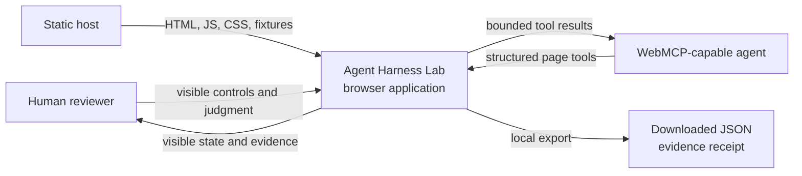

The browser application is the complete MVP system. The static host supplies assets but participates in no domain decision. The evidence receipt is a user-initiated local download. No network call is required after the app loads.

## 4. Logical architecture

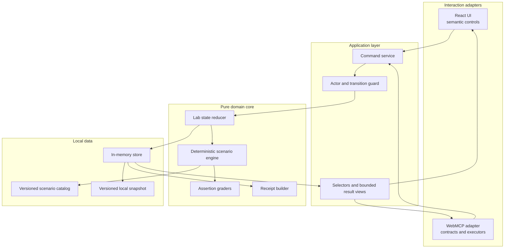

The arrows define allowed dependencies:

- Adapters may depend on application contracts, never on fixture internals.
- The application layer may orchestrate domain functions but cannot invent evaluation results.
- The domain core cannot import React, browser APIs, WebMCP, storage, or network clients.
- Persistence stores a completed stable snapshot, not a partially running command.

## 5. Deployment topology

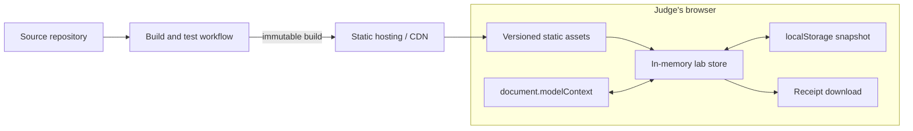

### 5.1 MVP runtime properties

- Single origin and static assets.
- No server-side session, database, worker queue, or secret.
- No cross-origin WebMCP tool exposure.
- Local persistence is optional convenience, not the source of fixture truth.
- A corrupt or incompatible snapshot is ignored and the app loads a clean mission state.
- Deployment must use HTTPS so supported browsers can expose experimental APIs safely.

## 6. Component responsibilities

| Component | Owns | Must not own |
| --- | --- | --- |
| UI adapter | Rendering, focus, announcements, human decision controls | Domain transition rules or hard-coded scores |
| WebMCP adapter | Tool schemas, annotations, registration lifecycle, result envelopes | Direct state mutation or decision authority |
| Command service | Input validation, actor context, sequencing, atomic dispatch | UI rendering or scenario-specific scoring |
| Transition guard | Legal state/actor combinations and typed domain errors | Browser authorization or authentication |
| Lab reducer | Canonical state transitions and append-only domain events | Time, network, randomness, or storage APIs |
| Scenario engine | Deterministic run facts for a fixture and harness version | Human decision or display formatting |
| Graders | Assertions over facts; evidence references | Generating run facts or aggregate marketing scores |
| Selectors | Bounded UI/tool views over domain state | Mutation or persistence |
| Receipt builder | Portable, versioned evidence record and stable hashes | Hidden chain-of-thought or secret data |
| Snapshot adapter | Versioned serialization to browser storage | Canonical fixture definitions |

## 7. Domain model

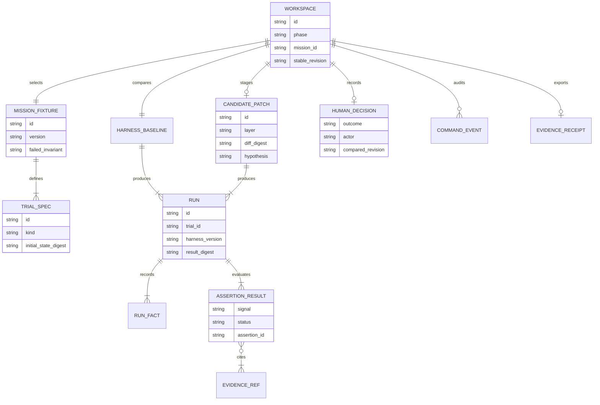

### 7.1 Important distinctions

- A **trial specification** declares initial state, expected facts, and assertions.
- A **run** is the deterministic execution of one harness version against one trial.
- A **run fact** states what observably occurred.
- An **assertion result** interprets facts against a declared requirement.
- A **signal summary** groups assertion results; it is not independently editable.
- A **decision** references the exact compared revision so later changes cannot inherit approval.

## 8. State machine

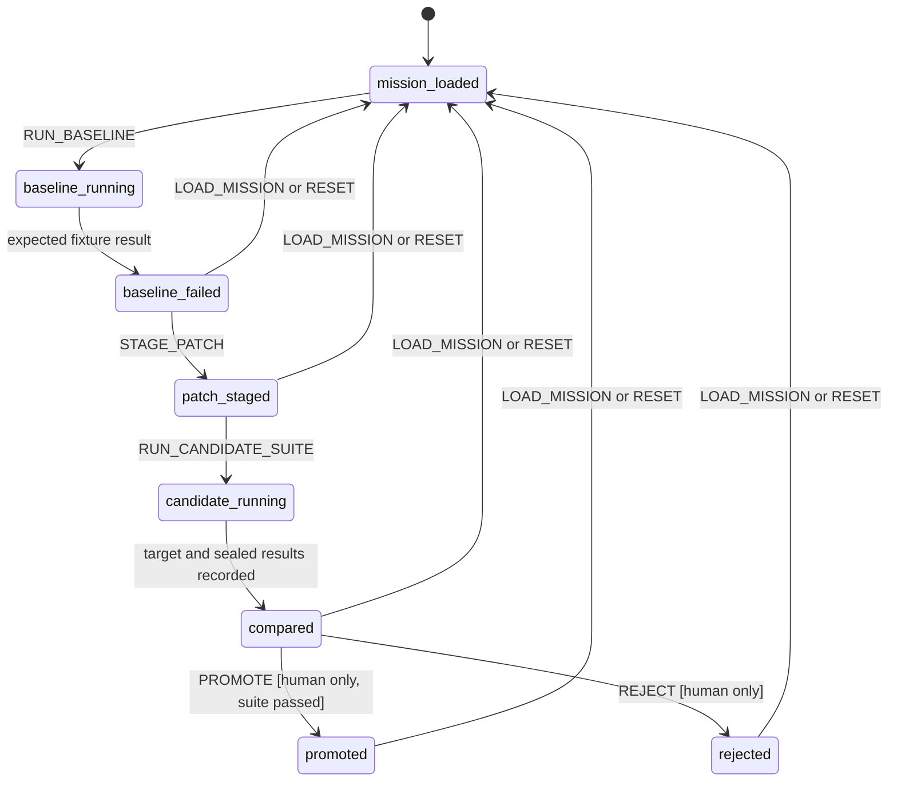

### 8.1 Transition rules

- `LOAD_MISSION` is legal from any stable state and creates a new workspace revision.
- Only one command may run at a time. A transient run lock rejects concurrent commands.
- The running phases are transient command-service state. A runtime error commits no domain event and leaves the canonical store at the exact prior stable revision; the calling adapter owns bounded pending and error status.
- `COMPARE` is represented by the completed `compared` state; reading comparison is a selector, not a mutation.
- `PROMOTE` and `REJECT` require actor `human` and an unchanged compared revision.
- `PROMOTE` additionally requires a passing candidate suite; a failed comparison may only be rejected.
- Decisions are terminal for that candidate. A new candidate begins with a reset or mission reload in the MVP.

## 9. Command architecture

Every mutation enters through one function:

```ts
dispatch(command: LabCommand, context: CommandContext): Promise<CommandResult>
```

`CommandContext` contains a generated command ID, actor (`human`, `agent`, or `system`), source (`ui`, `webmcp`, or `bootstrap`), and an abort signal. It does not contain arbitrary permissions supplied by the caller.

### 9.1 Command matrix

| Command | Human UI | WebMCP | Legal from | Stable result |
| --- | --- | --- | --- | --- |
| `LOAD_MISSION` | Yes | Yes | Any stable state | `mission_loaded` |
| `RUN_BASELINE` | Yes | Yes | `mission_loaded` | `baseline_failed` |
| `STAGE_PATCH` | Yes | Yes | `baseline_failed` | `patch_staged` |
| `RUN_CANDIDATE_SUITE` | Yes | Yes | `patch_staged` | `compared` |
| `PROMOTE` | Yes | No | `compared` with passing suite | `promoted` |
| `REJECT` | Yes | No | `compared` | `rejected` |
| `RESET` | Yes | No | Any stable state | `mission_loaded` |

State, trace, comparison, and receipt reads use selectors rather than mutation commands.

### 9.2 Atomic command flow

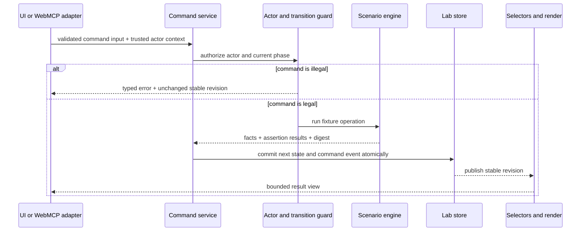

Inputs are validated before the domain transition. A command either commits one stable revision or commits nothing. UI loading and error indicators are transient adapter state, not canonical provenance and not evidence that a domain run completed. PR 4 may expose bounded adapter activity for WebMCP usability, but it must remain distinct from the successful domain event log and evidence receipt.

## 10. End-to-end collaboration flow

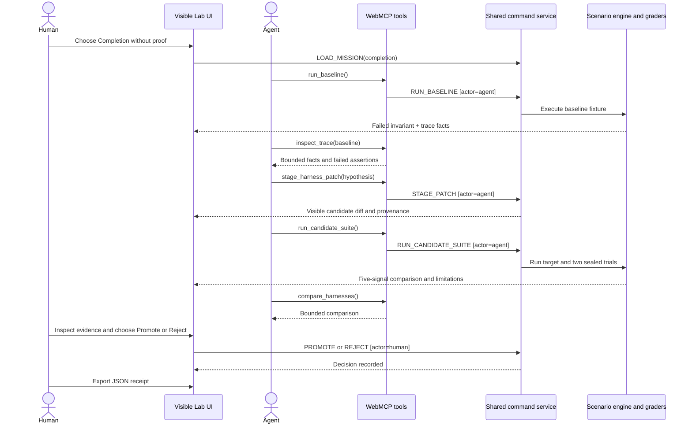

The agent never receives a promotion tool. A request to promote by tool name fails discovery; a forged command with actor `agent` also fails at the transition guard. The second control prevents an adapter bug from bypassing the product boundary.

## 11. Deterministic scenario engine

### 11.1 Scenario contract

Each scenario module exports immutable data and pure behavior:

```ts
interface ScenarioDefinition {
  id: ScenarioId;
  version: string;
  invariant: string;
  baseline: HarnessDefinition;
  candidate: CandidateDefinition;
  trials: readonly TrialSpec[];
  assertions: readonly AssertionSpec[];
}
```

The target and sealed trials share the same execution path. A `kind: "sealed"` label controls disclosure in the UI, not the evaluation algorithm.

### 11.2 Fact generation and grading

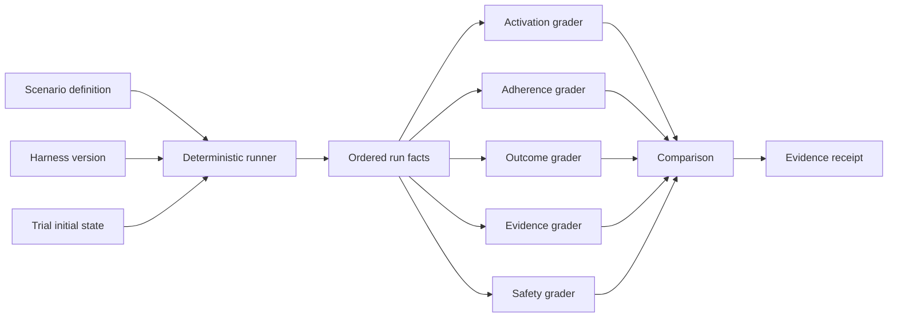

The runner does not write scores. Graders refer to stable assertion IDs and fact IDs. A signal summary is derived by counting passed, failed, and not-applicable assertions. The UI may visualize these counts but cannot override them.

### 11.3 Determinism rules

- No `Math.random()`, live clock, network, model API, or environment-dependent branch.
- Stable IDs derive from scenario, version, trial, and run role.
- Canonical JSON serialization is used for fixture and result digests.
- Display timestamps may be generated at export time but are excluded from causal result hashes.
- Repeated execution must produce byte-equal canonical result data.

## 12. Evidence pipeline

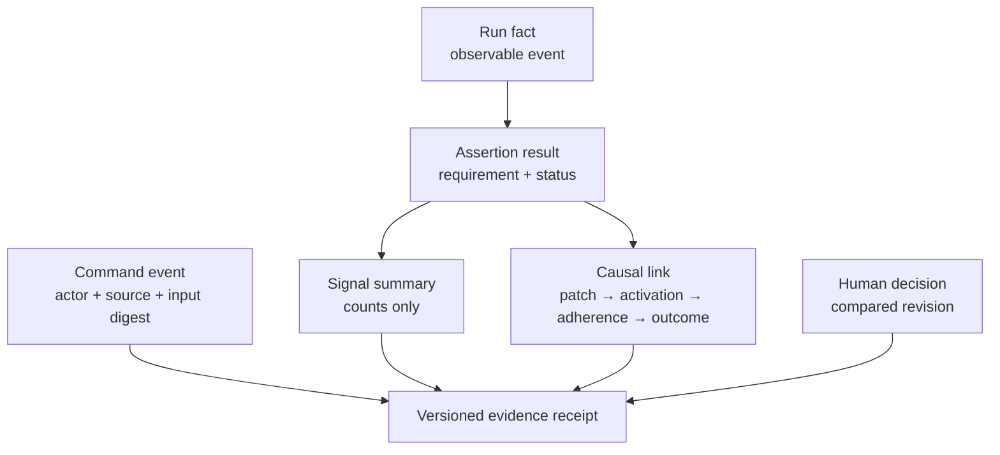

Facts and assertions are append-only within a completed run. A later human decision references them but does not rewrite them. This makes the receipt reviewable and prevents promotion from turning a failed assertion into a pass.

## 13. Receipt design

The JSON receipt is a portable review artifact, not a deployment instruction.

```json
{
  "schema": "agent-harness-lab-receipt/0.1",
  "fixture": true,
  "scenario": { "id": "completion", "version": "1" },
  "harnesses": { "baseline": "1.3", "candidate": "1.4-rc" },
  "candidate": {
    "layer": "skill-trigger+completion-contract",
    "hypothesis": "...",
    "diff_digest": "sha256:..."
  },
  "runs": [],
  "signals": {},
  "unresolved_risks": [],
  "decision": { "outcome": "promoted", "actor": "human" },
  "limitations": ["Built-in deterministic fixture", "No live model"]
}
```

The receipt builder validates against a checked-in JSON Schema. It rejects unsupported values and strips fields that are not in the schema. Free-form hypothesis text is bounded and serialized as data.

## 14. WebMCP adapter

### 14.1 Registered tools

The adapter registers:

- `get_lab_state`
- `load_mission`
- `run_baseline`
- `inspect_trace`
- `stage_harness_patch`
- `run_candidate_suite`
- `compare_harnesses`
- `export_evidence_receipt`

Registration uses `document.modelContext.registerTool()` behind feature detection. An `AbortController` owns the lifecycle so hot reload or page teardown cannot leave duplicate tools.

### 14.2 Result envelope

Every executor returns a bounded structure:

```ts
type ToolResult<T> =
  | { ok: true; data: T; state: LabStateSummary }
  | { ok: false; error: DomainErrorView; state: LabStateSummary };
```

Tool results do not return the entire store. Trace reads require a run identifier and optional cursor/limit. The MVP fixtures are small, but the bounded contract prevents a future imported trace from flooding agent context.

### 14.3 Security annotations and boundaries

- State, trace, comparison, and receipt reads use `readOnlyHint`.
- Imported content will use an untrusted-content annotation when that capability is available; built-in fixture text is still escaped before rendering.
- Tool descriptions state side effects and explicitly say when an operation does not promote or deploy.
- Unknown properties are rejected.
- Tool names are narrow domain verbs rather than generic script or fetch capabilities.
- No tool accepts a URL, filesystem path, code string, credential, or arbitrary command.

## 15. Persistence and recovery

The in-memory store is authoritative while the page is open. After each stable transition, the snapshot adapter writes a versioned projection to `localStorage`:

```ts
interface StoredSnapshot {
  schemaVersion: 1;
  fixtureCatalogVersion: string;
  stableState: SerializableLabState;
  savedAt: string;
}
```

On boot:

1. Parse the snapshot as untrusted data.
2. Validate schema and catalog version.
3. Recompute derived signal summaries.
4. Restore only a stable state.
5. Fall back to the default mission on any error.

Running state, dialog state, focus, toast messages, and WebMCP registration state are never persisted.

## 16. Error handling and concurrency

Domain errors are typed and user-safe:

- `INVALID_INPUT`
- `UNKNOWN_MISSION`
- `ILLEGAL_TRANSITION`
- `ACTOR_NOT_AUTHORIZED`
- `RUN_ALREADY_ACTIVE`
- `STALE_REVISION`
- `RECEIPT_INVALID`

An error view includes a code, concise message, legal next actions, and current stable revision. Stack traces remain in development diagnostics and are not returned to WebMCP clients.

One in-process command lock prevents overlapping runs. The command ID provides idempotency within the current page session: retrying a completed command ID returns its prior bounded result; retrying an active command ID joins or receives `RUN_ALREADY_ACTIVE`. The MVP has no cross-tab coordination; a later shared service would require durable idempotency keys and optimistic concurrency.

## 17. Trust boundaries and threat model

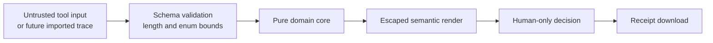

| Threat | Control |
| --- | --- |
| Prompt injection in imported text | Treat text as data, annotate untrusted content, never execute it as instruction |
| Tool input attempts arbitrary action | Closed schemas, enums, length bounds, no generic fetch/eval/file tools |
| Agent self-approves its patch | No decision tool plus actor guard on decision commands |
| Stale comparison is approved | Decision references and checks the current compared revision |
| Partial run appears complete | Atomic stable-state commit and transient adapter-only loading state |
| Fixture is mistaken for production evidence | Persistent fixture labels and receipt limitations |
| Receipt leaks secrets | No secret inputs; allowlisted schema; export tests |
| Cross-origin capability abuse | Same-origin registration only in MVP |

The Lab's local “promotion” changes only its own fixture state. It never edits or deploys an external harness.

## 18. Accessibility architecture

Accessibility behavior belongs in the adapter but is verified as a system property:

- Native buttons, headings, dialog, table semantics, and tab roles.
- One logical DOM order that remains meaningful when desktop regions stack.
- Store subscriptions update a polite live region with command completion or error.
- Focus moves only for explicit navigation events, such as opening a dialog; rerenders do not steal focus.
- Reduced-motion mode removes artificial execution delay and decorative transitions.
- Evidence tables use headers and captions; narrow layouts use internal overflow with a visible affordance when necessary.

## 19. Verification architecture

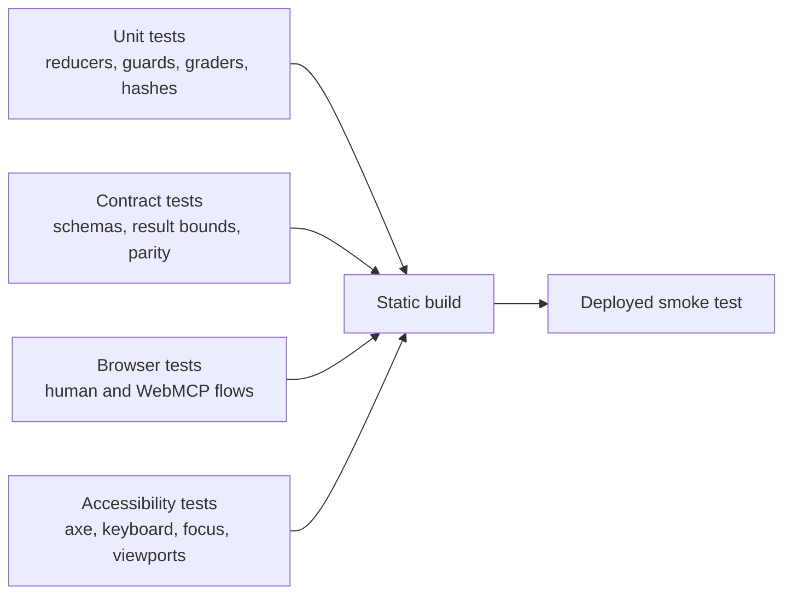

Critical contract tests run the same command sequence twice, once with `source: ui` and once with `source: webmcp`, normalize command provenance, and assert equal domain snapshots. A separate discovery test asserts that no promotion, rejection, deployment, fetch, filesystem, or arbitrary execution tool is registered.

## 20. Source layout

The target implementation uses these dependency boundaries:

```text
src/
├── app/          # command service, guards, store, selectors
├── domain/       # pure types, reducer, assertions, decisions
├── scenarios/    # four immutable fixture definitions
├── webmcp/       # contracts, registration, executors, result views
├── receipts/     # schema, canonicalization, builder
├── ui/           # React screens, components, styles, accessibility
└── main.tsx      # composition root only
```

The [repository and technology one-pager](Repository%20and%20Tech%20Stack.md) owns the complete proposed tree and library choices.

## 21. Future adapter architecture

Real-agent support is added outside the deterministic core:

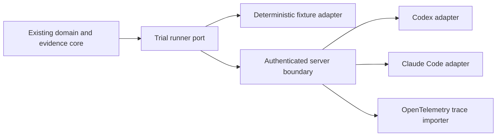

The browser must never receive provider credentials. External runners require authenticated jobs, isolated workspaces, durable idempotency, redaction, cancellation, cost limits, and explicit human approval for side effects. Imported facts are normalized into the same run and assertion model; they do not bypass it.

## 22. Deliberate tradeoffs

| Decision | Benefit | Cost accepted for MVP |
| --- | --- | --- |
| Static local app | Reliable demo, no accounts or secrets | No shared workspaces or remote trials |
| Deterministic fixtures | Reproducible causal explanation | Does not prove live-model effectiveness |
| Custom reducer store | Explicit, testable transitions | More domain code than ad hoc component state |
| Five separate signals | Prevents misleading aggregate score | More UI and explanation than one pass/fail badge |
| Human-only decision | Clear accountability | Agent cannot complete the last step autonomously |
| No chart library | Small bundle and semantic markup | Bespoke visualization components |

## 23. Open decisions after the challenge

- How scenario authors sign or review fixture updates.
- Which trace interchange format becomes the first import contract.
- Whether real trials run in repository worktrees, disposable containers, or provider-managed sandboxes.
- How evidence receipts are signed and linked to source commits.
- What sample size and statistical model are required before claiming live harness improvement.
- How team roles divide patch authorship, evaluation, and promotion authority.

None of these decisions blocks the deterministic challenge MVP.
