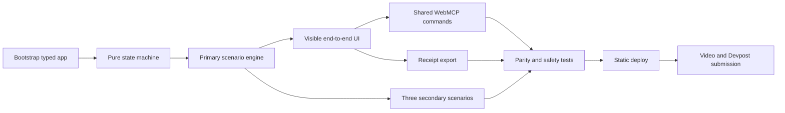

# Agent Harness Lab — Implementation Plan

**Plan date:** August 30, 2026<br>
**Submission deadline:** September 3, 2026 at 1:00 p.m. PT<br>
**Delivery strategy:** Protect the deterministic end-to-end demo first; add breadth only after the primary loop is deployable<br>
**Related documents:** [PRD](Agent%20Harness%20Lab%20PRD.md) · [Architecture](Architecture.md) · [Repository and stack](Repository%20and%20Tech%20Stack.md)

## 1. Outcome

Deliver a public, licensed, deployed WebMCP application in which a person and an agent can:

1. Reproduce a known harness failure.
2. Inspect the failed trajectory and invariant.
3. Stage one reviewable harness patch with a causal hypothesis.
4. Run the target and two sealed fixtures.
5. Compare activation, adherence, outcome, evidence, and safety.
6. Leave the final Promote or Reject decision to the person.
7. Export a truthful evidence receipt.

The live experience, repository, submission description, and sub-three-minute video must tell the same product story.

## 2. Starting point

The concept package already provides:

- A researched product thesis and adjacent-landscape analysis.
- A detailed PRD and target architecture.
- A self-contained interactive HTML mockup.
- Four deterministic scenarios.
- Eight WebMCP contracts implemented in the mockup.
- A human-only promotion/rejection boundary.
- A primary demo flow validated manually at desktop, 390 px, and 320 px.

The mockup is not yet the production challenge app. Its domain state, fixture logic, rendering, and WebMCP registration live in one HTML file. The implementation work separates those concerns, adds automated contracts, creates a deployable build, and prepares the public submission artifacts.

## 3. Fixed constraints

- The challenge closes September 3, 2026 at 1:00 p.m. PT.
- The submission needs a working live URL, text description, public demo video with audio under three minutes, and a public code repository with an open-source license.
- The primary loop must not depend on a model key, backend, authentication, or network request after load.
- Promotion and rejection stay human-only.
- Every result remains labeled as a built-in deterministic fixture.
- Real agent execution, trace imports, accounts, and team collaboration stay outside the challenge critical path.

## 4. Critical path



If time compresses, secondary visual polish yields before any item on the A→H path. The primary Completion without proof scenario, WebMCP parity, human decision boundary, deployed URL, public repository, and video are non-negotiable.

## 5. Workstream and pull-request plan

Each implementation slice should be independently reviewable. Do not combine refactoring, visual redesign, and behavior changes in one pull request.

### PR 0 — Concept package and architecture

**Purpose:** Establish the product contract before code extraction.

Deliverables:

- Product proposal, research brief, PRD, architecture, and implementation plan.
- Interactive mockup and metadata.
- Repository/technology decision.

Acceptance:

- Relative documentation links resolve.
- Mermaid blocks are syntactically reviewable on GitHub.
- Mockup script parses and the existing end-to-end fixture flow still works.
- Repository remains private during this review stage.

### PR 1 — Application shell and pure domain core

**Purpose:** Create the deployable TypeScript foundation and legal transition model.

Deliverables:

- Vite + React + strict TypeScript scaffold.
- `LabState`, `LabCommand`, `DomainEvent`, and typed error contracts.
- Pure reducer, actor/transition guard, command service, and selectors.
- Versioned in-memory store with subscriptions.
- Unit tests for all legal and illegal transitions.

Acceptance:

- `npm run typecheck`, unit tests, and production build pass.
- No domain module imports React, DOM, storage, or WebMCP APIs.
- An agent actor cannot dispatch Promote or Reject even through a forged adapter call.
- Failed commands leave the previous stable revision unchanged.

### PR 2 — Scenario engine, graders, and primary fixture

**Purpose:** Produce trustworthy evidence for Completion without proof.

Deliverables:

- Scenario, trial, harness, fact, assertion, and signal types.
- Deterministic runner and canonical JSON hashing.
- Five assertion graders.
- Completion without proof target and two sealed trials.
- Baseline/candidate comparison selector.

Acceptance:

- Baseline fails the declared invariant as expected.
- Candidate passes target and both sealed cases.
- Twenty repeated suite executions produce identical canonical results.
- Signal summaries can be traced back to assertion and fact IDs.
- No component or fixture stores a manually authored aggregate score.

### PR 3 — Core UI and human decision flow

**Purpose:** Turn the domain core into a coherent product experience.

Deliverables:

- Mission rail, run header, trajectory, patch, evidence, decision, and activity regions.
- Keyboard-operable tabs and contract dialog.
- Loading, error, and screen-reader announcement behavior.
- Human-only Promote and Reject controls.
- Responsive layout based on the approved mockup.

Acceptance:

- A person completes the primary flow without developer tools.
- Controls reflect legal state and prevent out-of-order actions.
- Human decision records the exact compared revision.
- Keyboard, visible focus, reduced motion, 320 px, 390 px, desktop, and 200% zoom checks pass.
- Page-level horizontal overflow is zero at required widths.

### PR 4 — WebMCP adapter and parity contracts

**Purpose:** Make the page meaningfully agent-operable without duplicating product logic.

Deliverables:

- Eight schemas, descriptions, annotations, executors, and bounded result views.
- Feature detection and `AbortController` registration lifecycle.
- Adapter mapping from tool inputs to the shared command service and selectors.
- Contract harness for discovery and executor calls.

Acceptance:

- All eight tools register in a supported browser.
- Manual controls remain functional when WebMCP is absent.
- Equivalent UI and WebMCP command sequences produce equal normalized domain snapshots.
- Invalid IDs, unknown properties, oversized hypotheses, and illegal order fail safely.
- Discovery includes no promotion, rejection, deployment, URL fetch, filesystem, or arbitrary execution capability.
- Agent tool calls update the visible UI and activity provenance immediately.

### PR 5 — Remaining scenarios, receipts, and persistence

**Purpose:** Complete the regression story and portable evidence output.

Deliverables:

- Broken context handoff, Lost tool response, and Authority drift fixtures.
- Target and two sealed trials per scenario.
- JSON receipt schema, builder, canonical digest, and download flow.
- Versioned local snapshot adapter and safe recovery.

Acceptance:

- All four scenarios replay deterministically.
- Receipt schema validates for undecided, promoted, and rejected states.
- Receipts include fixture disclosure, unresolved risks, and human provenance.
- Receipt allowlist excludes hidden reasoning and unexpected fields.
- Invalid or stale local snapshots fall back to a clean mission.

**Implementation note (August 30, 2026):** This slice is implemented with four executable fixtures, reviewed golden digests, strict receipt validation and download, and replay-validated local recovery. Unit coverage repeats every fixture 20 times; contract coverage completes all four through WebMCP; browser coverage refreshes the baseline, staged-patch, comparison, and promotion states and verifies the downloaded receipt digest. Unit coverage additionally round-trips the clean and rejected stable states.

### PR 6 — Release candidate, deployment, and submission assets

**Purpose:** Turn the working build into a judge-ready submission.

Deliverables:

- End-to-end Playwright flows for human and agent paths.
- Automated accessibility checks and manual QA record.
- Static deployment and deployed smoke test.
- Final README, setup instructions, screenshots, and architecture link.
- Open-source license selected by the owner.
- Public repository visibility set by the owner.
- Devpost description and public YouTube demo with audio under three minutes.

Acceptance:

- Production build and all automated checks pass from a clean clone.
- Deployed app completes the same flow in ChatGPT's in-app browser.
- Console is clean during the primary flow.
- Repository About section visibly detects the license.
- Public source contains everything required to run the app.
- Video demonstrates human/agent collaboration, WebMCP tools, and the human-only boundary.
- Devpost draft contains live URL, public repository URL, and video URL before final submission.

## 6. File-by-file implementation order

```text
1. package.json, tsconfig.json, Vite and test configuration
2. src/domain/types.ts
3. src/domain/errors.ts
4. src/domain/reducer.ts
5. src/app/guards.ts
6. src/app/commands.ts
7. src/app/create-store.ts
8. src/app/selectors.ts
9. src/scenarios/types.ts
10. src/scenarios/completion-without-proof.ts
11. src/domain/evaluation.ts
12. src/ui primary-flow components
13. src/webmcp/contracts.ts
14. src/webmcp/execute.ts
15. src/webmcp/register.ts
16. remaining scenario modules
17. src/receipts and receipt schema
18. snapshot adapter
19. contract and browser tests
20. submission documentation and assets
```

This order establishes the domain dependency direction before adapter code. UI and WebMCP work may proceed in parallel only after command and selector contracts are stable.

## 7. Four-day execution schedule

### August 30 — Foundation and concept review

- Create the private repository and minimal `main` branch.
- Open PR 0 with the complete concept package.
- Scaffold strict TypeScript, Vite, React, Vitest, and Playwright on the next branch.
- Implement domain types, stable phases, actor guard, reducer, and command tests.

**End-of-day gate:** Clean production build and fully tested state machine.

### August 31 — Primary end-to-end product

- Implement deterministic engine and Completion without proof fixture.
- Extract the approved mockup into semantic React components and CSS.
- Complete human flow from mission load through decision and receipt preview.
- Attend or review office hours only if it does not threaten the end-to-end gate.

**End-of-day gate:** Primary flow works locally without WebMCP or a backend.

### September 1 — WebMCP and complete fixture set

- Register all eight tools through the shared application layer.
- Add discovery, invalid-order, authorization, and parity tests.
- Add the other three scenario definitions and sealed cases.
- Implement receipt schema and local snapshot recovery.

**End-of-day gate:** Human and agent paths produce equivalent pre-decision evidence across all fixtures.

### September 2 — Release candidate and submission draft

- Run full unit, contract, browser, accessibility, responsive, reduced-motion, and console checks.
- Deploy the release candidate and test it in the ChatGPT in-app browser.
- Select and add the open-source license with owner approval.
- Change repository visibility to public with owner approval.
- Draft Devpost copy, capture screenshots, record and upload the demo video.

**End-of-day gate:** All submission URLs exist and the release candidate is frozen except for blocking fixes.

### September 3 — Final verification and submit before 1:00 p.m. PT

- Re-run the deployed primary flow and WebMCP discovery.
- Verify live URL, public repository, visible license, video visibility, and audio.
- Confirm Devpost text matches the implemented product and contains no unsupported claims.
- Submit early enough to recover from an upload or form failure.

**Final gate:** Devpost displays the submitted project and every public URL works in a signed-out browser.

## 8. Test plan

### 8.1 Unit tests

- Every legal state transition.
- Every illegal state transition.
- Human versus agent authorization.
- Deterministic facts and hashes.
- Activation, adherence, outcome, evidence, and safety graders.
- Receipt canonicalization and schema validation.
- Snapshot migration and rejection.

### 8.2 Contract tests

- Exact WebMCP tool discovery set.
- Input schema happy paths and rejections.
- Bounded result envelopes.
- Read-only annotations.
- UI/WebMCP state parity after normalized provenance.
- Human-only decision capability absence.

### 8.3 Browser tests

- Complete human primary flow.
- Complete agent primary flow through registered tools.
- Mixed flow: human loads, agent evaluates, human decides.
- Out-of-order tool calls.
- Mission reset and second scenario.
- Receipt download and content validation.
- Refresh recovery from each stable state.

### 8.4 Accessibility and responsive tests

- Keyboard-only completion.
- Tab and dialog focus behavior.
- Screen-reader status announcements.
- Axe scan on mission, staged, compared, and decision states.
- Reduced-motion behavior.
- Page overflow at 320 px, 390 px, desktop, 200% zoom, and long text.

### 8.5 Deployment tests

- Clean clone → install → test → build.
- Direct-route and asset loading under the deployment base path.
- HTTPS and WebMCP registration in supported browser.
- Signed-out live URL access.
- No console errors or failed network requests in the primary flow.

## 9. Definition of done

### Product

- The primary loop is coherent and takes less than three minutes to demonstrate.
- Four fixtures, five evidence signals, target and sealed cases, and receipt export are present.
- The human-only decision boundary is obvious in UI, tool discovery, and code.

### Engineering

- Strict typecheck, unit tests, contract tests, browser tests, accessibility checks, and production build pass.
- UI and WebMCP adapters share the command service.
- All scenario outcomes are deterministic and labeled.
- No secret or backend is required.

### Repository

- README explains product, setup, architecture, WebMCP tools, test commands, and limitations.
- Source and assets are complete from a clean clone.
- License is owner-selected and detected at the repository top level.
- Default branch is public and matches the deployed release commit.

### Submission

- Live URL, public repository URL, and public video URL are verified.
- Video is under three minutes, has audible narration, and shows a real WebMCP interaction.
- Description answers why WebMCP fits, what humans and agents do together, implementation details, and limitations.
- Submission is confirmed before the deadline.

## 10. Risk register

| Risk | Early signal | Mitigation | Cut if necessary |
| --- | --- | --- | --- |
| WebMCP API behavior differs between environments | Tool registration or schema rejection | Keep a tiny registration harness; test in target browser daily | Decorative contract explorer, not core tools |
| React extraction destabilizes validated mockup | Layout or focus regressions | Port tokens and regions incrementally; compare screenshots | Nonessential animation and ornament |
| Fixture engine becomes over-generalized | Scenario abstractions delay primary flow | Implement one vertical slice, then extract only repeated contracts | Scenario authoring DSL |
| Secondary scenarios consume critical time | Primary flow not deployed by Sep 1 | Keep them data-driven and visually reuse the same views | Rich per-scenario custom visuals |
| Video or deployment fails late | No public URLs by Sep 2 evening | Freeze early; keep static deployment provider fallback | Last-minute polish |
| Public license/visibility decision is delayed | Repository remains private on Sep 2 | Put explicit owner gate on calendar; prepare but do not assume license | Nothing; this is submission-critical |
| Product is mistaken for live agent benchmarking | Reviewers ask where model calls occur | Label fixture data everywhere and demonstrate the actual product claim | Any latency/cost/model-quality decoration |

## 11. Scope cuts in order

If the schedule slips, cut in this order:

1. Decorative motion and nonessential illustration.
2. Local snapshot resume.
3. Custom visualization for secondary fixtures.
4. Secondary fixture polish while retaining their data and tests.
5. Receipt download UI polish while retaining structured tool output and schema.

Do not cut:

- The primary target and sealed trials.
- Shared UI/WebMCP command logic.
- Five-signal evidence comparison.
- Human-only promotion and rejection.
- Truthful fixture labels and limitations.
- Accessibility of the primary flow.
- Public licensed repository, deployed URL, and demo video.

## 12. Submission narrative

The final demo should follow this script:

1. **Problem (20 seconds):** A harness patch can look good without being activated or followed.
2. **Baseline (30 seconds):** The agent reproduces Completion without proof and reads the missing browser-QA evidence.
3. **Candidate (35 seconds):** The agent stages a narrow trigger and completion gate with a causal hypothesis.
4. **Challenge (40 seconds):** The agent runs the target and sealed cases; the visible matrix separates five signals.
5. **Human boundary (25 seconds):** The person reviews limitations and promotes or rejects; no promotion tool exists.
6. **Proof (20 seconds):** Export the receipt and briefly show the shared command architecture.

Target length: approximately 2 minutes 50 seconds, leaving margin below the three-minute limit.

## 13. Post-submission backlog

- Real trace import and normalization.
- Harness bundle import with redaction.
- External agent trial runner behind a server boundary.
- Team review roles and signed receipts.
- Pull-request generation after explicit approval.
- Scenario-authoring toolkit and community fixture registry.
- Statistical experiment design for live harness comparisons.

These items begin only after the deterministic challenge release is submitted and preserved.
